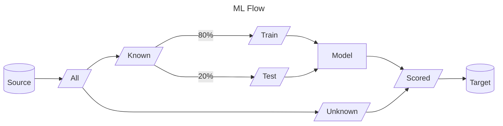

```mermaid
---
title: ML Flow
---
flowchart LR
  SO[(Source)]
  A[/All/]
  K[/Known/]
  UK[/Unknown/]
  TR[/Train/]
  TE[/Test/]
  M[Model]
  SC[/Scored/]
  TA[(Target)]

  SO --> A
  A  --> K
  A  --> UK
  K  ----> |80%| TR
  K  ----> |20%| TE
  TR --> M
  TE --> M
  M  --> SC
  UK --> SC
  SC --> TA
```
